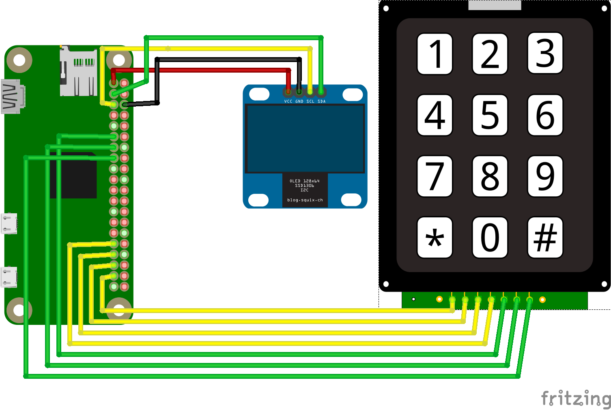

# Tala

[](https://www.codacy.com/app/malvern-code-club/tala?utm_source=github.com&utm_medium=referral&utm_content=malvern-code-club/tala&utm_campaign=badger)

A text only portable communication device designed for an apocolypse.

## talalib.py

talalib.py is a Python module to interact with *most* of the sensors in the Tala
project. You can read the documentation for this module [here](talalib.md).

## Wiring



***Wiring for modules may not be as they show in this diagram! We bought 2 OLED
screens and the pinouts on both are different. Be careful!***

### Screen

| Screen | Raspberry Pi     |
| ------ | ---------------- |
| VCC    | 3v3 *(Pin 1)*    |
| GND    | Ground *(Pin 6)* |
| SCL    | SCL *(Pin 5)*    |
| SDA    | SDA *(Pin 3)*    |

### Keypad

| Keypad | Raspberry Pi      |
| ------ | ----------------- |
| Row 1  | BCM 26 *(Pin 37)* |
| Row 2  | BCM 19 *(Pin 35)* |
| Row 3  | BCM 13 *(Pin 33)* |
| Row 4  | BCM 6 *(Pin 31)*  |
| Col 1  | BCM 17 *(Pin 11)* |
| Col 2  | BCM 27 *(Pin 13)* |
| Col 3  | BCM 22 *(Pin 15)* |

### HC-12 Module

| HC-12 | Raspberry Pi      |
| ----- | ----------------- |
| VCC   | 3v3 *(Pin 17)*    |
| GND   | Ground *(Pin 9)*  |
| RXD   | BCM 14 *(Pin 8)*  |
| TXD   | BCM 15 *(Pin 10)* |

## Installation

1. Start by flashing the latest Raspbian Lite onto an SD card.
2. After it has booted type `sudo raspi-config` to bring up a configuration
window, select `Interfacing Options` -> `I2C` -> `Yes`, then `Interfacing Options`
-> `Serial` -> `No` -> `Yes`. **Rebooting now is not required as we will do it
in the 4th step.**
3. Setup a Wi-Fi connection (you can skip this if you are using ethernet) by
editing this file with the command: `sudo nano /etc/wpa_supplicant/wpa_supplicant.conf`.
Then adding this block of code (changing the placeholders to your network) to the
bottom of the file:
```
network={
  ssid="YOUR NETWORK NAME HERE INSIDE THE QUOTES"
  psk="YOUR NETWORK PASSWORD HERE INSIDE THE QUOTES"
}
```
4. Reboot using the command `sudo reboot`.
5. Start the automatic install script with this command `curl -sSL https://goo.gl/xPTBjq | sudo bash`.
6. Et volia!
